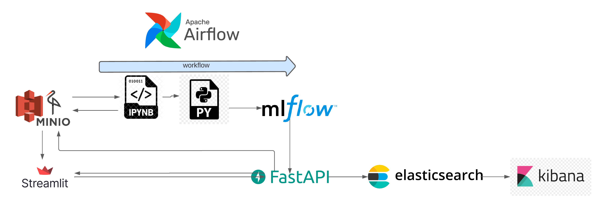

# NBA Players Investment System
This project is a prediction system for basketball player investment which utilizes a microservices architecture. The system comprises of several different services, including a machine learning model that has been trained to predict the investment potential of a basketball player, a frontend service that allows users to interact with the system and make requests, and an MLflow service that is responsible for managing and selecting the most performant model. All these services are Dockerized, ensuring ease of deployment and scalability. The model takes requests from the frontend and returns predictions, while the MLflow service is used to track and retrieve the best-performing model. Airflow automates the workflow from data processing to model deployment on mlflow registry. Elasticsearch and kibana are used to store and monitor the model performance and the data entries.

## The Pipeline
### The system is deployed on azure VM 


## Main technologies
* [Mlflow](https://mlflow.org/), used to track the performance of the models, store the best models and lastly manage the staging of the best models
* [Python](https://www.python.org/), the programming used to build the logic
* [Airflow](https://airflow.apache.org/), was used to automate the workflow from data reading and processing to model deployment on mlflow
* [FastAPI](https://fastapi.tiangolo.com), was used to deploy the models as Rest API
* [Streamlit](https://streamlit.io), was used to build the dashboards and be the entrypoint to interact with the system
* [Docker](https://www.docker.com/), was used to deploy the microservices in isolated containers that communicate wit eachothers 
* [Elasticsearch-Kibana](https://www.elastic.co/elk-stack), Elasticsearch was used to store the predictions made by the deployed model, Kibana was used to vizualise and monitor the entry data distribution and the predictions made by the models

## Project Microservices:
1. **Service 1 - `FastAPI model`**: contains endpoints for making predictions based on input data. <br />
   Deployed at `http://20.224.70.229:4100/`. - [clickable link](http://20.224.70.229:4100/)
2. **Service 2 - `Mlflow service`**: tracks performance of models, automatically uploads best models to registry, and delivers them to FastAPI service for predictions. <br />
   Deployed at `http://20.224.70.229:5000/`. - [clickable link](http://20.224.70.229:5000/)
3. **Service 3 - `Streamlit service`**: front end for inspecting and visualizing data and interacting with deployed models by submitting own data or viewing model details. <br />
   Deployed at `http://20.224.70.229:8501/`. - [clickable link](http://20.224.70.229:8501/)
4. **Service 4 - `MinIO storage`**: responsible for storing data in various formats (raw, processed, training, validation, testing, batch predictions). Allows all containers to share necessary data and write to a bucket. <br />
   Deployed at `http://20.224.70.229:9001/`, accessible with a user: `abdessamadbaahmed` and password: `baahmedabdessamad` which can be viewed/modified in the `docker-compose` file. - [clickable link](http://20.224.70.229:9001/).
5. **Service 5 - `Airflow service`**: orchestrates workflow for training models periodically using new incoming data, automatically upgrades the best model to production and updates the FastAPI service by retrieving from the registry. <br />
   Deployed at `http://20.224.70.229:8080/`, accessible with a user: `airflow` and password: `airflow` which can be viewed/modified in the `docker-compose` file. - [clickable link](http://20.224.70.229:8080/).
4. **Service 6 - `Elasticsearch-kibana`**:, allows to store the data entries that the rest api receives, and the predictions made by the model on the elasticseach instance. A kibana container is connected to the elasticsearch instance and allows to monitor and vizualize the data indexed on elasticsearch in real time <br />
   Elasticsearch deployed at `http://20.224.70.229:9200/`, Kibana deployed at `http://20.224.70.229:5601/` file. - [clickable link](http://20.224.70.229:5601/).


## Project Structure
1. **`folder 1 - data`**: contains the data used by the notebooks in the expirements phase, it serves as a backup in case we cannot connect to minIO or if the data on the minIO bucket is lost. 
2. **`folder 2 - mlflow_server`**: contains the dockerfile used to build and deploy the mlflow service, it also stores the data so that we don't lose it when the container is down. 
3. **`folder 3 - model_deployment_server`**: contains the fastapi application that deploys the models as Rest API, the dockerfile to build the docker container, test.py and test.ipynb contains the files in order to test the two endpoints of the api and see if they are working properly.
4. **`folder 4 - monitoring_server`**: contains a notebook that commands some commands in order to interact with Elasticsearch and verify if its working correctly, the host may need to be changed depending on the environment.
5. **`folder 5 - notebooks`**: contains all of the experiments that were made in order to preprocess the data, build the models, track the performance of the models, and finally push them into the model registry in a production stage. The notebooks were the building block for the pipeline that was created as a workflow script and also as a scheduled dag in airflow. The pipeline are nothing but code snippets from the notebooks aggregated in a python script.
6. **`folder 6 - orcherstration_server`**: contains a python script pipeline.py that contains all of the necessary steps from reading data from minIO bucket, preprocessing it, performing parameter tuning, push the best model to mlflow registry, compare it to the current version running in prod if its perform better the model is push to the production stage. A deployed version of this script was deployed as an airflow DAG to run periodically and this in an automated fashion without having to run the script manually. docker-compose.yaml in this folder is responsible of deploying an airflow with all the necessary dependencies that it needs.
7. **`folder 7 - streamlit_app`**: contains the files responsible for creating the system entrypoint, the dockerfile is responsible for deploying the web-app in its isolated container, the code within the folder is responsible for the dashboards allowing for the viz of the data and also it allows us to interact with the model by sending in data.


## Run The APP: <span style="color: red;">The app is really heavy, 10 containers in total it's quite complicated to run the whole system on a local machine</span>

1. Create a python env (a conda env can also be used)
```
conda create -n myenv python=3.9
conda activate myenv
```

2. Install all of the dependencies
```
pip install -r requirements/requirements.txt
```

3. in the root directory we can launch the docker-compose that will launch all of the services but the airflow service that has it's own docker-compose file
```
docker-compose up --build -d 
```

4. under the folder orchestration_server run the docker-compose file responsible of launching the airflow service 

```
echo -e "AIRFLOW_UID=$(id -u)" > .env
docker compose up airflow-init
docker-compose up 
```


